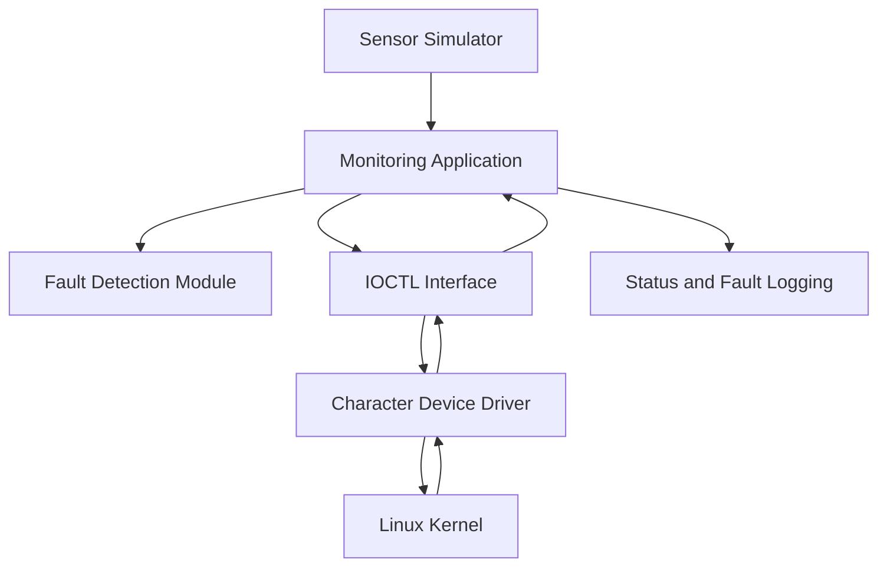
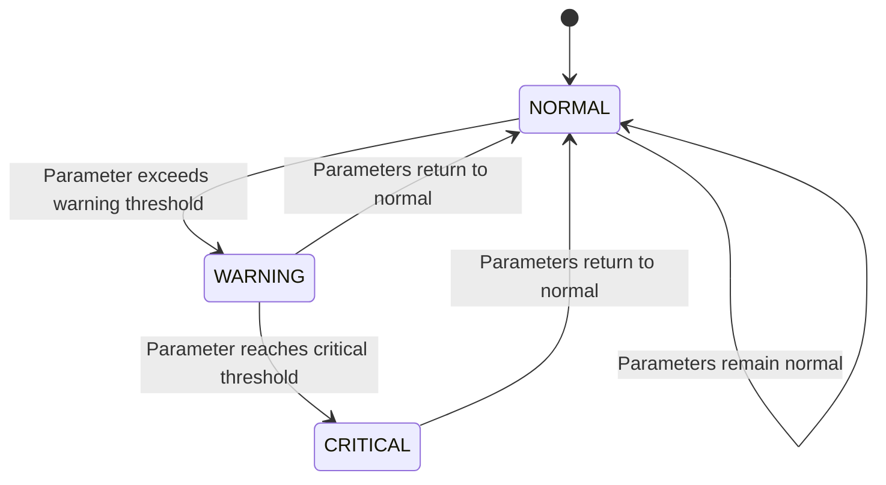

# System Architecture

## Overview

The system is a Linux-based industrial equipment monitoring and fault detection system implemented using C/C++ and a custom Linux character device driver.

The system consists of a user-space monitoring application, sensor simulation, fault detection logic, logging, and a Linux kernel-space character device driver.

## Architecture Diagram



## Major Components

### 1. Sensor Layer

Provides simulated industrial equipment parameters:

- Temperature
- Vibration
- Motor RPM
- Voltage
- Current

### 2. Monitoring Application

The C++ user-space application:

- Reads sensor values
- Sends sensor data to the kernel driver
- Receives sensor information from the driver
- Displays equipment status
- Retrieves driver statistics
- Reports detected faults

### 3. Fault Detection Module

The fault detection module evaluates sensor parameters and classifies the equipment condition as:

- NORMAL
- WARNING
- CRITICAL

### 4. IOCTL Interface

IOCTL commands provide communication between the user-space application and the Linux character device driver.

The interface is defined in:

`include/driver_interface.h`

### 5. Linux Character Device Driver

The driver is implemented in C as a Linux kernel module.

It:

- Creates `/dev/industrial_monitor`
- Handles device open and close operations
- Processes IOCTL requests
- Stores sensor information
- Maintains driver statistics
- Records warning and critical fault events
- Generates kernel log messages

### 6. Linux Kernel

The driver executes in kernel space and provides the interface between the monitoring application and the operating system.

### 7. Logging Layer

The system records monitoring and fault events and also provides kernel-level logging through `dmesg`.

## Communication Flow

The general communication sequence is:

1. Sensor values are generated by the sensor simulator.
2. The monitoring application receives the values.
3. The application sends sensor data to the character device.
4. IOCTL communication transfers the request to the kernel driver.
5. The driver processes and stores the sensor data.
6. The application retrieves the required information.
7. The fault detection module determines the equipment condition.
8. The application displays the equipment status.
9. The driver records relevant kernel events and statistics.

## User Space and Kernel Space

```mermaid
flowchart LR
    A[User Space] --> B[Monitoring Application]
    B --> C[IOCTL]
    C --> D[/dev/industrial_monitor]
    D --> E[Kernel Space]
    E --> F[Character Device Driver]
    F --> E
    E --> D
    D --> C
    C --> B
```

## System States

The monitoring system classifies equipment into three major states:



## Technologies

- C
- C++
- Linux
- Linux Kernel Modules
- Character Device Driver
- IOCTL
- GCC
- G++
- Make
- Git
- GitHub
