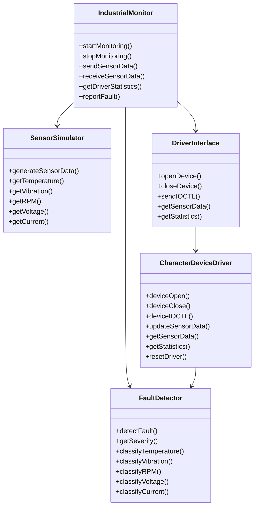

# Class Diagram

## Overview

The class diagram represents the major user-space components of the Industrial Equipment Monitoring and Fault Detection System.



## Component Responsibilities

### IndustrialMonitor

The main user-space monitoring component.

Responsibilities:

- Controls the monitoring cycle.
- Communicates with the character device.
- Sends sensor data.
- Receives sensor information.
- Retrieves driver statistics.
- Displays equipment status.

### FaultDetector

Responsible for evaluating sensor values.

Responsibilities:

- Checks temperature.
- Checks vibration.
- Checks motor RPM.
- Checks voltage.
- Checks current.
- Determines NORMAL, WARNING, or CRITICAL status.

### SensorSimulator

Provides simulated industrial sensor values for the prototype.

The simulated parameters are:

- Temperature
- Vibration
- Motor RPM
- Voltage
- Current

### DriverInterface

Provides the user-space interface used to communicate with the Linux character device driver.

It defines the IOCTL-based communication interface.

### CharacterDeviceDriver

The custom Linux kernel-space character device driver.

Responsibilities:

- Handles device operations.
- Processes IOCTL requests.
- Updates sensor data.
- Provides sensor data to user space.
- Maintains driver statistics.
- Records fault events.
- Resets driver statistics.

## Relationships

The main interaction is:

```text
SensorSimulator
       |
       v
IndustrialMonitor
       |
       +----> FaultDetector
       |
       +----> DriverInterface
                    |
                    v
          CharacterDeviceDriver
```

The monitoring application therefore acts as the main user-space controller, while the character device driver provides the kernel-space communication interface.
